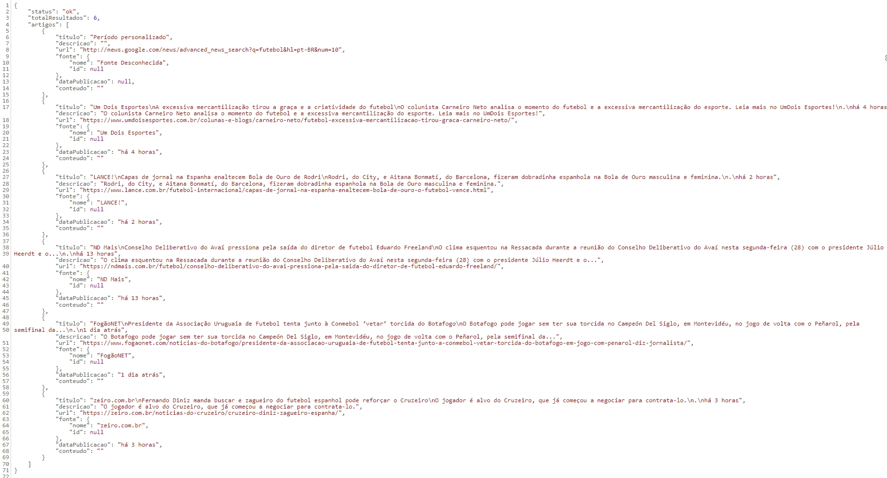
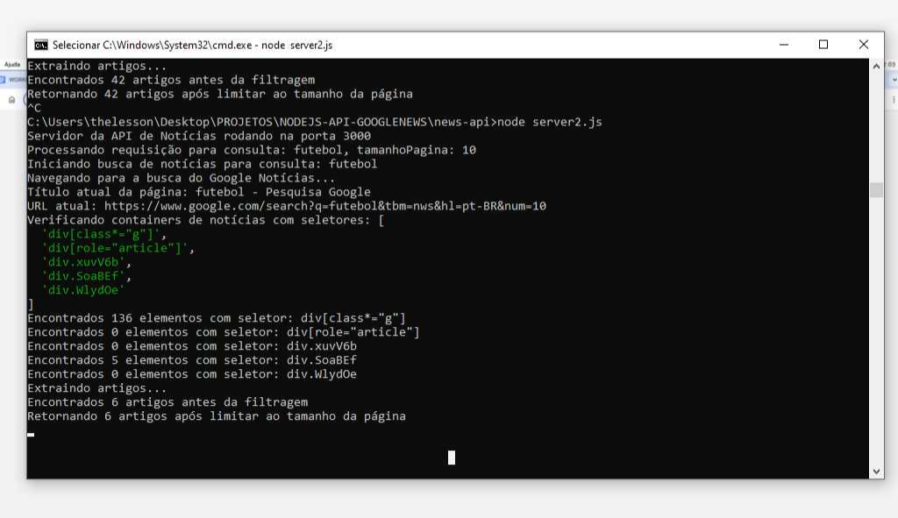

# Crawler Google News com Node JS
Um Crawler simples que retorna em json resultados de busca do Google News


<p align="center">
  
</p>
<p align="center">
  
</p>

## Instalação 

Clone o projeto e rode os comandos de instalação
```
npm install express puppeteer cors
```
Execute o server.js
```
node server.js
```
## Execução 
Enquanto o server estiver sendo executado, insira os parametros de busca seguindo o modelo: http://localhost:3000/api/noticias?q=${termoConsulta}&tbm=nws&hl=pt-BR&num=${tamanhoPagina}
ex: http://localhost:3000/api/noticias?q=futebol&tbm=nws&hl=pt-BR&num=100

